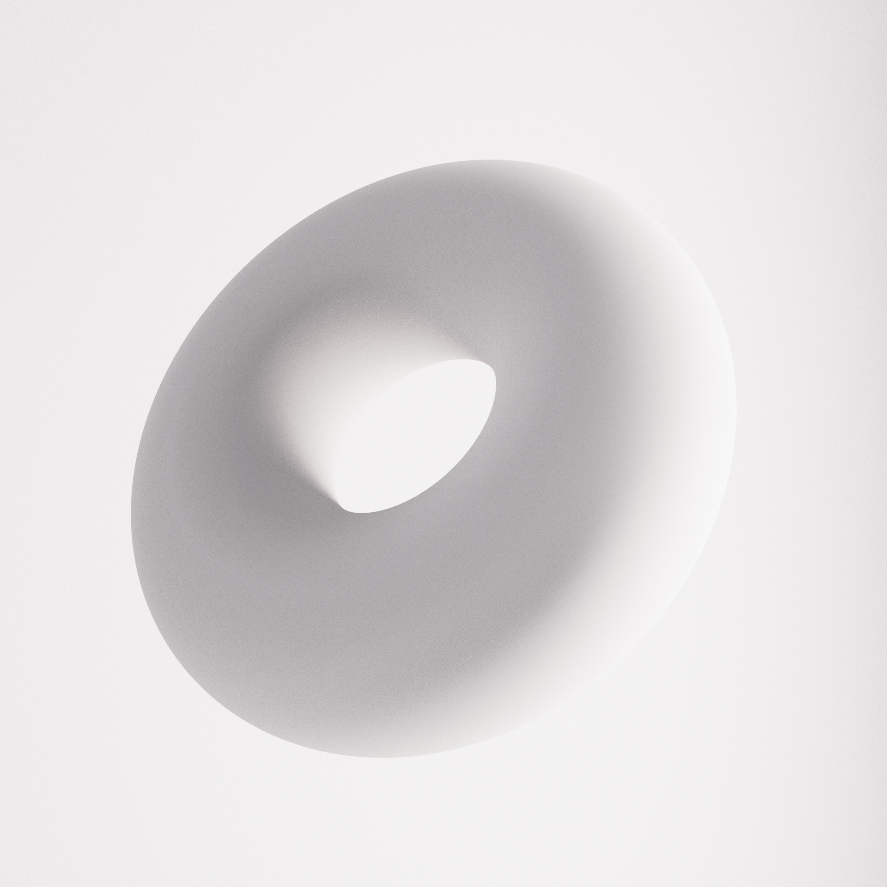
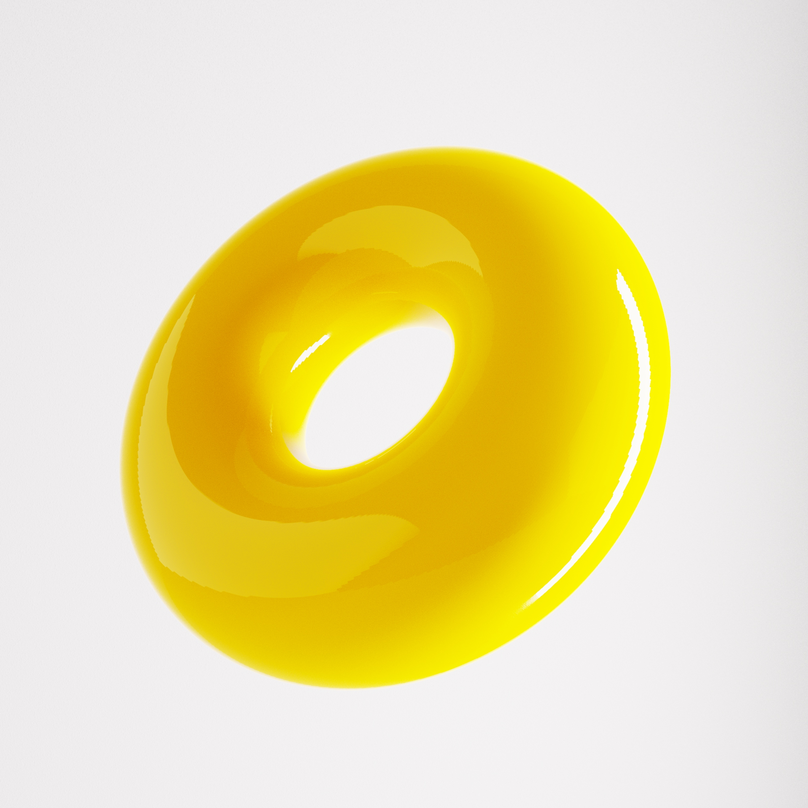
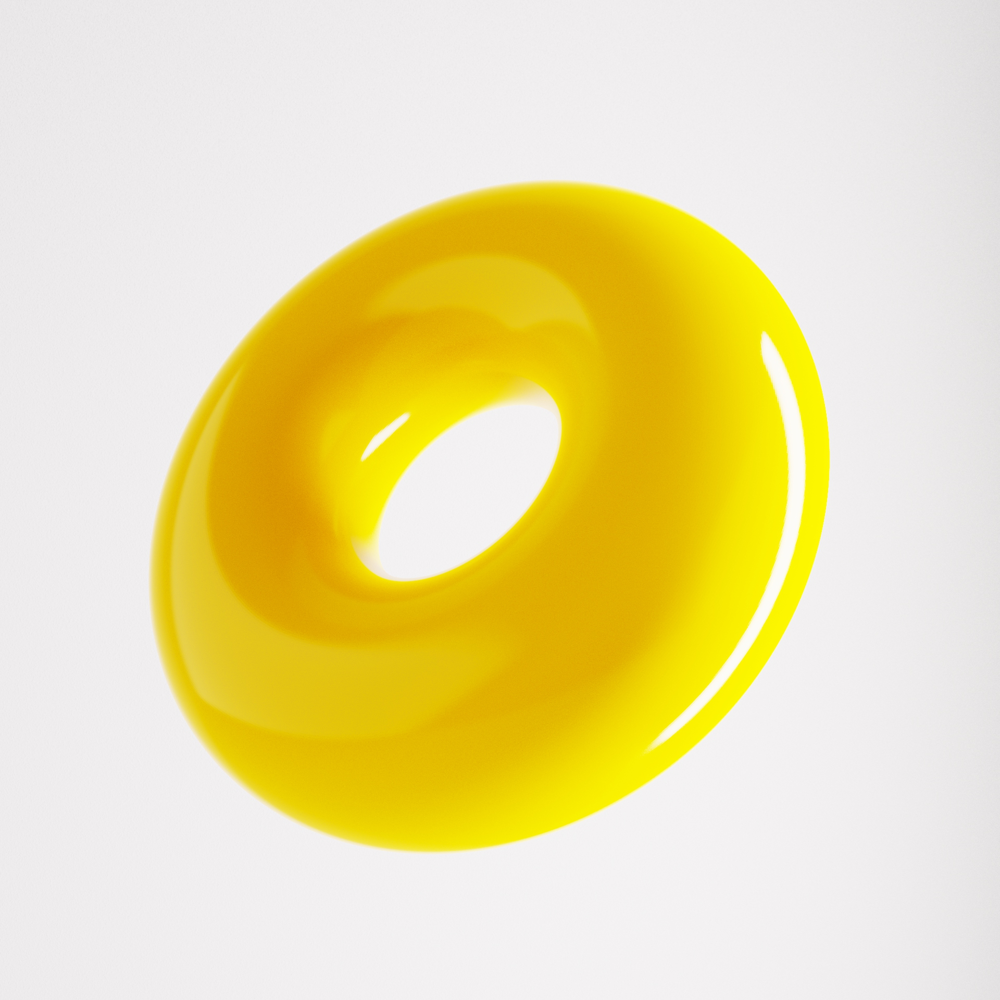
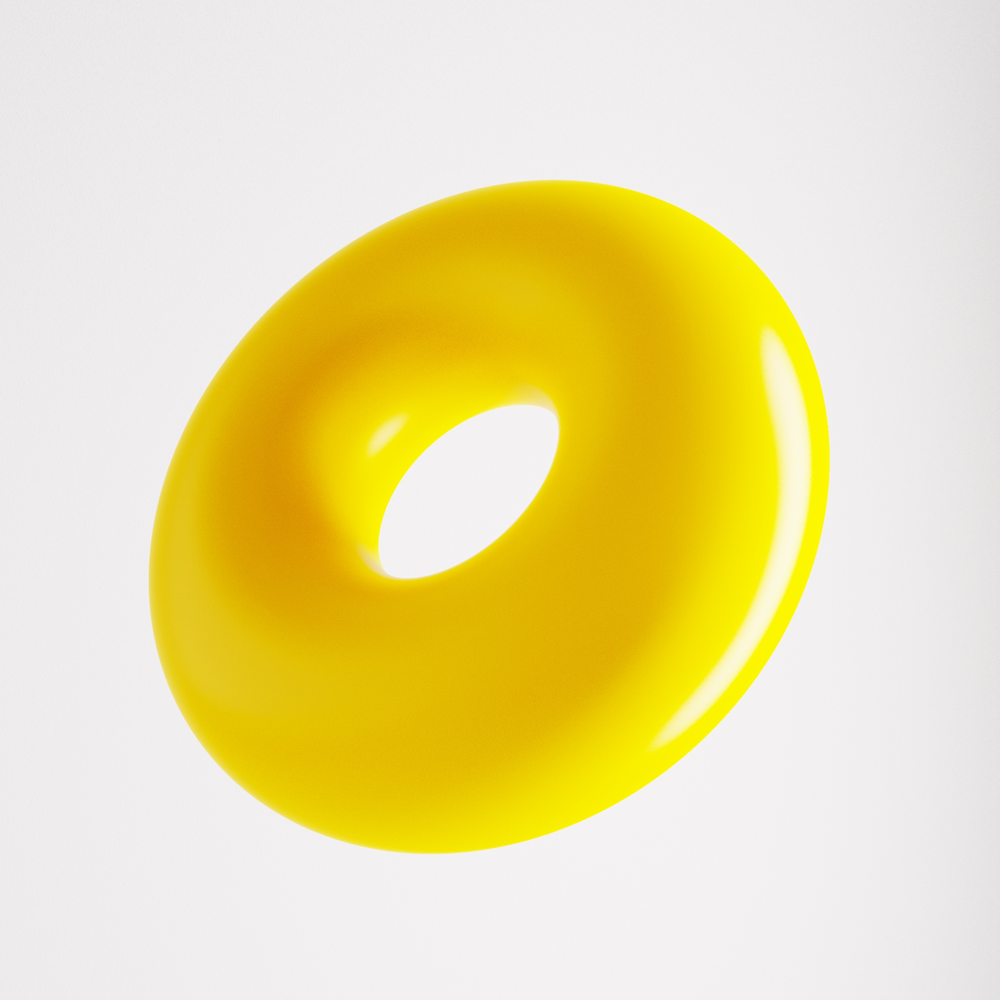
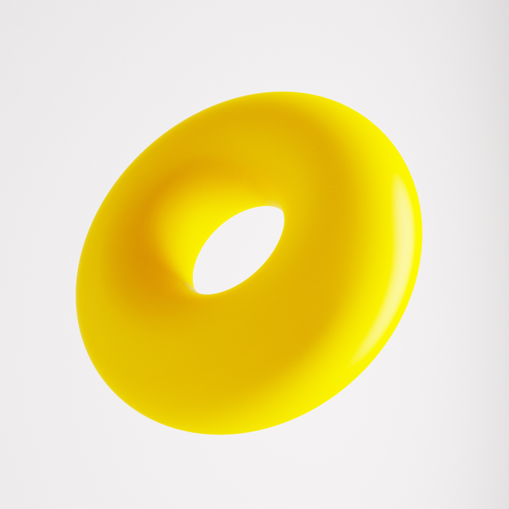
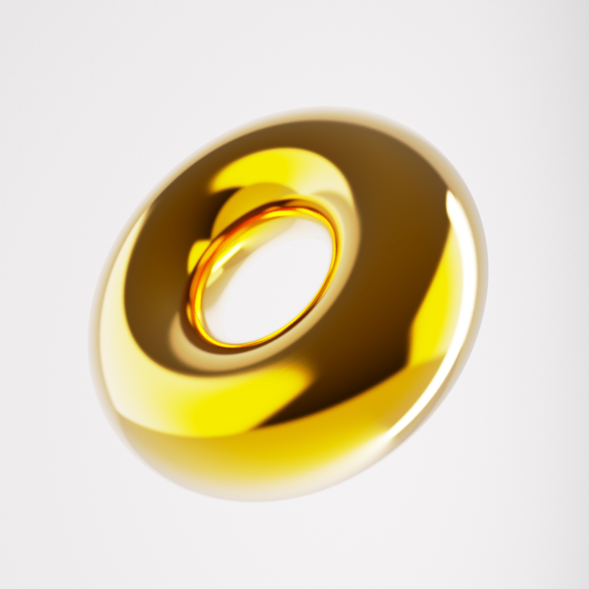
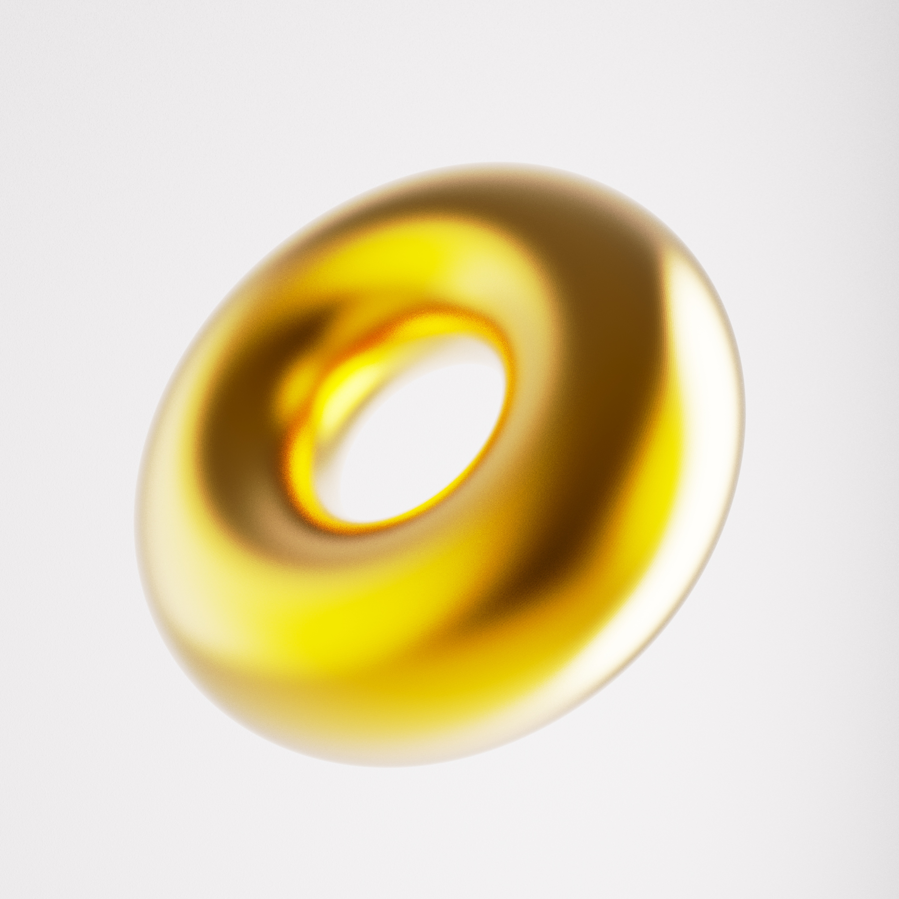

# CONCEPTES BÀSICS DE REPRESENTACIÓ TRIDIMENSIONAL

## TOPOLOGIES

## MATERIALS

[Documentació Materials Three](https://threejs.org/docs/#api/en/materials/Material)

## IL.LUMINACIÓ

### PLÀSTICS

### METALLS

### TEXTURES

### ATRES EXEMPLES

